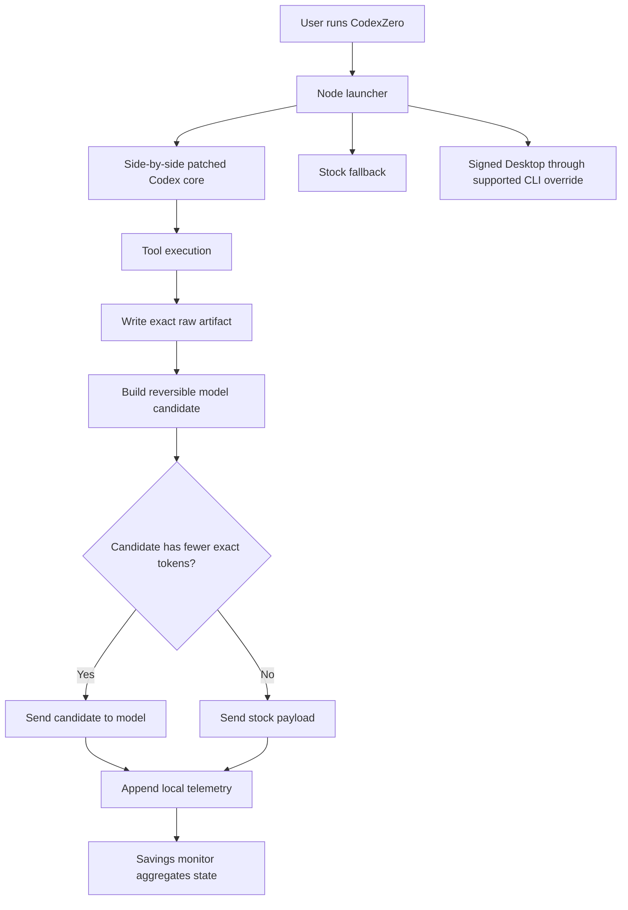

# CodexZero complete project reference

This is the canonical technical and operational record for CodexZero. It
documents what changed, why it changed, how the repository works, what was
measured, what was deliberately left unchanged, and which verification items
remain open.

Documented implementation: **CodexZero 0.3.0**
Repository: <https://github.com/Retro2512/CodexZero>
Project site: <https://retro2512.github.io/CodexZero/>
Latest published release: <https://github.com/Retro2512/CodexZero/releases/latest>
License: MIT

---

## 1. What CodexZero is

CodexZero is a side-by-side Codex build and launcher that reduces redundant
model-visible tool output without removing evidence.

In plain language:

1. A command runs normally.
2. Its complete raw output is saved locally.
3. CodexZero creates a reversible compact candidate representation.
4. The stock and candidate payloads are counted with the same tokenizer.
5. The candidate is used only when it has strictly fewer tokens.
6. Otherwise Codex receives the original stock payload.
7. The decision and measured difference are recorded locally without storing
   prompt or conversation text in telemetry.

The stock Codex installation remains untouched and immediately available
through `codex-zero stock`.

### Project promise

> Send a compact tool-result view only when its token count is lower, while
> keeping the original output recoverable.

### Monotonic means

An optimization is monotonic when enabling it cannot produce a model payload
with the same or a larger token count:

```text
selected = candidate_tokens < original_tokens ? candidate : original
```

Equal-sized candidates, larger candidates, unsupported output, unproven source
state, and failed artifact writes all fall back to stock behavior.

---

## 2. Compatibility baseline and non-negotiable constraints

The implementation began against:

| Component | Version or location |
|---|---|
| Codex Desktop | `26.715.10079.0` |
| Stock Codex CLI | `0.139.0` |
| Patched upstream tag | `rust-v0.145.0-alpha.30` |
| Patched upstream commit | `3b61fac9` |

The Safe optimizer was required to preserve all of the following:

- the selected model and reasoning effort;
- prompt content in Safe mode, and output verbosity in both modes;
- compaction thresholds and subagent policy;
- tools, MCP servers, apps, skills, plugins, permissions, and review support;
- every raw tool-output byte;
- sandbox and approval behavior;
- the signed Codex Desktop package;
- the installed stock CLI;
- errors, warnings, exit codes, and non-identical diagnostic lines.

It was not allowed to use lossy summaries, approximate compression, heuristic
log filtering, repository RAG, changed model routing, or disabled tools. Version
0.2.0 adds prompt shortening only as an explicit installer choice, scoped to
CodexZero launches.

---

## 3. What changed, phase by phase

### Phase 1 — Baseline and reproducible fixtures

Compatibility configuration was checked without committing local prompt or
capability-inventory data.

Seven reproducible fixture categories were added:

1. a silent 60-second process;
2. repeated complete output lines;
3. ANSI-colored and OSC-linked output;
4. two reads of one unchanged file;
5. two identical Git status calls;
6. a fixed three-command validation sequence;
7. a failing test with a large repeated stack trace.

The baseline captured the tool payloads needed for deterministic fixture
replay. Raw private captures and local session counters are excluded from Git.
Public reports contain only reproducible fixture counts and sanitized release
evidence.

### Phase 2 — Reasoning summary configuration

The CodexZero profile keeps:

```toml
model_reasoning_effort = "high"
model_reasoning_summary = "none"
```

It does **not** set `model_supports_reasoning_summaries = false`.

Regression coverage verifies that the outgoing request retains High reasoning
and encrypted reasoning state while omitting only the optional reasoning
summary. Both stock and custom launch paths pass strict-config validation.

### Phase 3 — Event-driven background-process waiting

The patched core adds `codex_zero_event_driven_wait`.

For an empty `write_stdin` call on a live process, the harness now waits
locally until one of these events occurs:

- new output;
- process exit;
- cancellation;
- permission pause;
- user interruption;
- the configured hard timeout.

An expired short polling interval with no state change does not create an empty
model-visible result. Non-empty stdin and the flag-off path retain stock
behavior.

The CodexZero profile sets:

```toml
background_terminal_max_timeout = 3600000
```

The specific baseline silent-60 fixture already produced only its opening and
final boundary requests, so no production call saving is claimed for that
sample. The implementation closes the uncovered empty-poll path and has a real
Windows unified-exec regression that waits past the stock compatibility
interval until silent exit.

### Phase 4 — Separate UI and model command payloads

The human-facing command result remains complete. The model-facing result can
use compact structured JSON that:

- keeps every required field;
- omits null and empty fields;
- does not repeat the command input;
- does not add an `Output` label when output is empty;
- includes current exit, process, wall-time, artifact, and token metadata;
- is selected only after an exact tokenizer comparison.

This separation lets the UI remain descriptive while avoiding redundant
model input.

### Phase 5 — Lossless terminal codec and raw artifact store

The patch adds the Rust crate `codex-zero-codec`.

Before any compact candidate can be selected, raw output is written to:

```text
~/.codex/codexzero/artifacts/sha256/<raw-sha256>
```

The artifact store:

- uses SHA-256 content addressing;
- records the exact raw byte count;
- verifies an existing object before reuse;
- fails closed on corruption or a hash collision;
- writes through a temporary file before moving into place.

The terminal codec may:

- remove presentation-only ANSI SGR styling;
- preserve OSC hyperlink visible text and URL;
- normalize line endings only when the result has fewer tokens;
- run-length encode only consecutive identical complete lines;
- retain the exact repetition count.

It may not:

- collapse non-identical lines;
- discard warnings, errors, or diagnostics;
- summarize stack traces;
- remove exit status;
- approximate output.

The reversible encoding is named `line-rle-v1`. A candidate includes the raw
artifact SHA-256, raw byte count, original token count, and codec identifier.

Launchers also request plain terminal output:

```text
NO_COLOR=1
TERM=dumb
PAGER=cat
GIT_PAGER=cat
GH_PAGER=cat
```

These environment values reduce avoidable presentation bytes at the source;
the exact smaller-than-stock gate still decides whether a transformed payload is used.

### Phase 6 — Exact duplicate suppression

The patched core hashes complete model-visible results and may replace a
repeated read-only result with a reference to its original active item.

Reuse requires all of the following:

- identical result content;
- an operation proven read-only;
- unchanged source state;
- the original result still present in active model context;
- a reference with strictly fewer tokens than the repeated result.

Source-state evidence includes:

- file blob SHA-256 and exact byte range for file reads;
- HEAD, logical index state, porcelain status, and changed-path hashes for Git
  state;
- repository fingerprints for supported local `rg`, `git grep`, and
  `git ls-files` searches.

Reuse is rejected for:

- side-effecting commands;
- remote operations;
- unrecognized command shapes;
- paths outside the repository;
- searches that follow links;
- hidden or ignored-source expansion;
- preprocessors;
- results whose source state cannot be proven;
- originals no longer active in context.

Volatile execution metadata is not used as the duplicate-content key, but the
current call still reports its own chunk, wall time, process state, exit code,
artifact hash, raw byte count, token count, and omitted-byte metadata.

### Phase 7 — Deterministic validation batching

`codex-zero run-checks <profile>` runs a repository-defined fixed sequence
locally and returns one structured result.

For each command it preserves:

- the command;
- exit code and signal;
- wall time;
- raw combined output;
- raw stdout;
- raw stderr;
- content-addressed artifacts for all three streams;
- UTF-8 model text or exact base64 when bytes are not valid UTF-8.

Progress is printed locally as `[current/total] command`. The model receives
the final batch instead of waking between every deterministic command.

Configuration lookup order:

1. `.codex/checks.json`
2. `codexzero.checks.json`
3. `fixtures/checks.json`

Profiles may be arrays or `{ "commands": [...] }` objects. String commands use
PowerShell on Windows and `/bin/sh -lc` on Unix. Structured
`{ "file": ..., "args": [...] }` commands avoid shell interpretation.

The included `fixture` profile runs:

1. `node --check app.js`
2. `git diff --check -- . :(exclude)patches/*.patch`
3. `node fixtures/repeated-lines.js 3`

Tests confirm that batched and unbatched forms run the same commands and
produce the same statuses and diagnostics.

### Phase 9 — Cache lineage and usage telemetry

The patch carries root-session cache-key lineage into child-agent work within
the same session while preserving exact-prefix matching and stable sharding.
It does not add explicit GPT-5.6 cache writes.

It also records `cache_write_input_tokens` when the upstream response supplies
that value.

Cache reads and writes remain separate from guaranteed token savings because
cache accounting and plan-limit effects are service-dependent.

### Phase 10 — Safe and Max Savings modes

The one-click installer now asks for one of two modes:

- `safe` is the default and preserves the existing model instructions;
- `max-save` is opt-in and adds the bundled 738-token model-instructions file.

The Max Savings prompt retains user authority, scope and authorization
boundaries, worktree protection, injection boundaries, proportional
verification, honest reporting, and concise intermediary updates. It removes
repeated behavior prose, permanent taste rules, response-shape rituals, fixed
progress timing, and obsolete model workarounds.

The launcher applies the prompt only to CodexZero processes. It does not write
global or project `AGENTS.md` files. Prompt benchmarks remain separate from
measured tool-result telemetry.

The original July 22 refactor measured 5,099 → 946 combined tokens (81.4%).
Restoring concise intermediary updates adds 58 model-prompt tokens, so the
recalculated lineage is 5,099 → 1,004 (80.3%). The active GPT-5.6-sol dated
model-only comparison is 3,552 → 738 (79.2%). At 50 model requests per day,
that 2,814-token difference projects to 4,221,000 tokens per 30 days and
51,355,500 per year.

---

## 4. Feature flags and fallback behavior

All four core optimizations are default-off in upstream-compatible source:

| Flag | Purpose | Flag-off behavior |
|---|---|---|
| `codex_zero_compact_exec_output` | Compact model-facing command JSON | Stock response text |
| `codex_zero_lossless_terminal_codec` | Reversible terminal encoding | Raw stock output |
| `codex_zero_exact_duplicate_results` | Proven active-result references | Re-send complete result |
| `codex_zero_event_driven_wait` | Keep empty process polls local | Stock polling timing |

The CodexZero launcher opts into all four and `unified_exec`.

Effective profile:

```toml
model_reasoning_effort = "high"
model_reasoning_summary = "none"
background_terminal_max_timeout = 3600000

[features]
unified_exec = true
codex_zero_compact_exec_output = true
codex_zero_lossless_terminal_codec = true
codex_zero_exact_duplicate_results = true
codex_zero_event_driven_wait = true
```

Each transformation also has an internal stock-payload fallback. Disabling one
feature does not require uninstalling CodexZero.

---

## 5. Architecture



### Responsibility boundaries

| Layer | Responsibility |
|---|---|
| Optional lean prompt | Goals, scope, authorization, preservation, verification, concise progress updates, honest reporting |
| Codex harness | Tools, context, exact selection, feature flags, session cache lineage |
| Codec | Raw artifact storage, reversible encoding, exact token gate |
| Wrapper | Side-by-side launch, environment defaults, monitor, stock fallback |
| Sandbox and approval system | Permission enforcement |
| Renderer/UI | Complete human-facing tool output and progress |
| Project instructions | Repository-specific requirements |

CodexZero does not move permission enforcement into model judgment.

### Runtime data paths

Default paths are relative to `CODEX_HOME`, normally `~/.codex`:

| Data | Default path |
|---|---|
| Installation | `~/.codex/codexzero/` |
| Wrapper app | `~/.codex/codexzero/app/` |
| Patched core | `~/.codex/codexzero/bin/codex-zero-core[.exe]` |
| Bundled lean prompt | `~/.codex/codexzero/prompts/codex-core-lean-v1.md` |
| Separate profile | `~/.codex/codexzero.config.toml` |
| Raw artifacts | `~/.codex/codexzero/artifacts/sha256/` |
| Telemetry stream | `~/.codex/codexzero/telemetry.jsonl` |
| Aggregated savings | `~/.codex/codexzero/savings.json` |
| Monitor PID | `~/.codex/codexzero/monitor.pid` |
| Installation metadata | `~/.codex/codexzero/install.json` |
| Launcher | `~/.codex/bin/codex-zero[.cmd]` |
| Backups | `~/.codex/backups/codexzero-install-<timestamp>/` |

### Runtime environment overrides

| Variable | Meaning |
|---|---|
| `CODEX_HOME` | Override normal Codex home |
| `CODEX_ZERO_HOME` | Override CodexZero state root |
| `CODEX_ZERO_ARTIFACT_DIR` | Override raw artifact directory |
| `CODEX_ZERO_TELEMETRY_FILE` | Override telemetry JSONL file |
| `CODEX_ZERO_BINARY` | Override patched core path |
| `CODEX_STOCK_BINARY` | Override stock CLI path |
| `CODEX_ZERO_DESKTOP_BINARY` | Override Desktop executable path |
| `CODEX_ZERO_RUNTIME_OVERRIDES=1` | Enable guarded core flags for Desktop runtime |
| `CODEX_ZERO_INSTRUCTIONS_FILE` | Optional Max Savings prompt path for the side-by-side core |
| `CODEX_ZERO_INSTALL_MODE` | Non-interactive installer mode selection |
| `CODEX_CLI_PATH` | Supported Desktop side-by-side CLI override |
| `CODEX_APP_SERVER_FORCE_CLI=1` | Force a fresh CLI-backed Desktop app server |

---

## 6. Command reference

### `codex-zero run [codex arguments]`

Runs the patched side-by-side CLI with the CodexZero profile, unified exec, all
four feature flags, local artifact paths, telemetry path, and plain-terminal
environment. In Max Savings mode it also passes the installed
`model_instructions_file`. Additional arguments are forwarded to Codex.

Examples:

```sh
codex-zero run
codex-zero run --strict-config --version
codex-zero run exec "explain this repository"
```

### `codex-zero desktop`

Starts the installed signed Codex or ChatGPT Desktop executable with the
side-by-side core through `CODEX_CLI_PATH`.

The command refuses to launch when Desktop is already running because
single-instance handoff would retain the old process environment.

```sh
codex-zero desktop --check
codex-zero desktop
```

`--check` resolves the executable without launching it.

### `codex-zero stock [codex arguments]`

Runs the existing stock `codex` command. It does not move files or change the
CodexZero profile.

```sh
codex-zero stock
codex-zero stock --strict-config --version
```

### `codex-zero savings [--json]`

Reads the local telemetry stream and reports cumulative measured values:

- transformed payloads;
- rejected candidates;
- exact duplicate references;
- model-visible tokens before and after;
- tokens eliminated;
- model calls eliminated;
- cached input and cache-write tokens;
- observed turns, input, uncached input, output, reasoning, and tool calls.

`--json` emits the `codex-zero-savings-v1` structure.

In Max Savings mode the command includes a separate `promptBenchmark` block based
on the dated prompt manifest. It is not added to observed tool-result totals.

### `codex-zero mode [safe|max-save]`

Shows or changes the optimization mode recorded in
`~/.codex/codexzero/install.json`. Changes apply to new CodexZero tasks and do
not modify global or project instructions.

### `codex-zero monitor`

```text
codex-zero monitor --start
codex-zero monitor --stop
codex-zero monitor --status
codex-zero monitor --once
codex-zero monitor --interval=5000
```

The service watches the telemetry directory and atomically replaces
`savings.json` after changes. It does not call a model, poll Codex, or read
conversation text. The minimum custom interval is 250 ms.

### `codex-zero run-checks <profile>`

Runs one deterministic local validation batch and emits
`codex-zero-run-checks-v1` JSON. A failing command stops the profile unless
`continueOnFailure` is enabled.

### `codex-zero doctor`

Checks:

- Codex home;
- main config presence;
- patched core presence;
- artifact location;
- telemetry location;
- Desktop executable resolution.

Missing Desktop is reported but only a missing custom core makes the command
fail.

---

## 7. Installation and upgrades

### Windows x64

```powershell
irm https://raw.githubusercontent.com/Retro2512/CodexZero/main/scripts/bootstrap.ps1 | iex
```

The bootstrap:

1. requests the latest GitHub release metadata;
2. selects `codex-zero-windows-x64.zip`;
3. downloads its `.sha256` file;
4. verifies the archive;
5. extracts to a temporary directory;
6. runs `scripts/install.ps1`.

The installer asks whether to use Safe or Max Savings mode, with
Safe selected by default, then
stops an existing recorded monitor, waits up to 15 seconds for
its process to release the bundled Node runtime, backs up the prior
installation and configs, installs the release, adds `~/.codex/bin` to the
user PATH, validates the core, runs `doctor`, and starts the monitor.

`-SkipMonitor` is available when calling `install.ps1` directly.

### macOS Intel and Apple silicon

```sh
curl -fsSL https://raw.githubusercontent.com/Retro2512/CodexZero/main/scripts/bootstrap.sh | sh
```

The bootstrap selects the Intel or ARM archive from `uname -m`, downloads the
archive and checksum, verifies with SHA-256, extracts it, and runs
`scripts/install.sh`.

The installer asks for the same choice with Safe as the default, then stops and waits for an existing monitor before replacing the
runtime, creates a backup, installs the platform core and bundled Node runtime,
creates `~/.codex/bin/codex-zero`, validates the core, runs `doctor`, and
restarts the monitor.

### Upgrade safety

Version 0.1.4 fixed in-place upgrades while the savings monitor is using the
bundled runtime. The release workflow now performs both a fresh install and a
second install with the monitor active on:

- Windows x64;
- Intel macOS;
- Apple silicon macOS.

All three checks passed before v0.1.4 was published.

### Source checkout

Release packages include Node. A source checkout can use Node.js 20 or newer.

The patched core can be reproduced with:

```sh
git clone --branch rust-v0.145.0-alpha.30 https://github.com/openai/codex.git upstream
git -C upstream apply ../CodexZero/patches/codex-rust-v0.145.0-alpha.30.patch
cargo build --manifest-path upstream/codex-rs/Cargo.toml -p codex-cli --release
```

Core patches are version-specific. The release carries its own verified core,
so it can coexist with a different installed stock CLI, but a future upstream
core requires a reviewed patch refresh and regression run before compatibility
is claimed.

---

## 8. Savings monitor and telemetry

### Telemetry format

Telemetry is append-only JSONL with schema `codex-zero-telemetry-v1`.

Supported event types:

| Event | Purpose |
|---|---|
| `exec_model_payload` | Record original/candidate selection for command output |
| `exact_duplicate_result` | Record full-result versus active-reference selection |
| `usage` | Record upstream token and tool-call counters |
| `model_call_eliminated` | Aggregated when emitted; no observed production events yet |

Payload-selection records can include:

- timestamp;
- original tokens;
- selected tokens;
- tokens eliminated;
- transformed boolean;
- raw artifact SHA-256;
- raw byte count;
- codec identifier.

Usage records can include:

- input tokens;
- uncached input tokens;
- cached input tokens;
- cache-write tokens;
- output tokens;
- reasoning tokens;
- tool-call count.

Telemetry does not require prompt text, commands, output content, repository
paths, environment values, or credentials.

### Aggregation behavior

`src/savings.mjs`:

- accepts only the expected schema;
- rejects malformed JSON with its line number;
- ignores unrelated schemas;
- treats missing or invalid numeric fields as zero;
- keeps cache effects separate;
- reports the first and last event timestamps.

The monitor writes the aggregate through a temporary file and atomic rename.

### Deterministic fixture replay

| Group | Original | Selected | Eliminated |
|---|---:|---:|---:|
| All fixture payloads | 6,699 | 1,072 | 5,627 (84.0%) |
| Repeated lines | 2,291 | 145 | 2,146 |
| Large failing stack | 3,962 | 481 | 3,481 |

Silent output, ANSI output, small repeated reads, Git status, and the three
small validation outputs used stock fallback because their candidates were
equal-sized or larger.

Fixture replay is regression evidence, not observed production savings. Almost
all of the corpus reduction comes from the two intentionally repetitive
fixtures.

### General projection method

The projection formula is:

```text
tool results per day
× assumed eligible share
× assumed average tokens removed per eligible result
× days
```

The site lets each reader choose all three workload assumptions. Results are
model-visible input-token scenarios, not observed savings. Codex plan limits
do not publish a token-to-quota conversion, so the project does not convert
scenarios into guaranteed requests, dollars, rate-limit capacity, or latency.

---

## 9. Safety, privacy, and preservation

### Safety properties

- Stock Codex is never patched, moved, or replaced.
- The signed Desktop package is never modified.
- Every optimization is default-off in compatible upstream source.
- Every optimization can be independently disabled.
- Every candidate must be strictly smaller.
- Raw output is stored before compact selection.
- Existing artifact content is verified before reuse.
- Duplicate reuse requires exact content and source-state identity.
- Side-effecting and remote operations are excluded from duplicate reuse.
- Sandbox, approval, permissions, and authority boundaries remain Codex
  responsibilities.

### Prompt choice and capability preservation

Safe mode preserves the existing model prompt. Max Savings mode applies
the bundled model prompt only to CodexZero launches. Both modes preserve:

- global and project instructions;
- model routing;
- output verbosity;
- compaction thresholds;
- subagent policy;
- tool schemas;
- MCP servers;
- apps;
- skills;
- plugins;
- permissions;
- review capability.

Regression tests verify that mode switching changes installation metadata only,
that Max Savings requires the installed bundled prompt, and that user instruction
files are not written.

### Public versus private evidence

The repository commits reproducible fixtures and release evidence.
These stay untracked:

```text
/work/
/private-artifacts/
/reports/local-verification.json
/reports/past-usage-summary.json
/target/
__pycache__/
*.pyc
```

Private raw session captures and local source builds must not be committed.

---

## 10. Compatibility and release record

### Supported packages

| Platform | Asset |
|---|---|
| Windows x64 | `codex-zero-windows-x64.zip` |
| Intel macOS | `codex-zero-macos-x64.tar.gz` |
| Apple silicon macOS | `codex-zero-macos-arm64.tar.gz` |

### v0.1.4 release evidence

Release workflow: `30066187627`

| Asset | Bytes | SHA-256 |
|---|---:|---|
| Windows x64 | 156,255,834 | `50aa02498b55e47a2d1425ac80541548ab562063b9ea230fcec383cc84a6054e` |
| Intel macOS | 162,328,651 | `71aa1b9cdd438d0825bb71e6012b1ac085ce37f24a23b1e707b289cb988f7915` |
| Apple silicon macOS | 155,888,492 | `47f76988258b523dd733ab9ecd1f755b5d0164d25def1f90793001eba66c16dc` |

Installed Windows release-core SHA-256:

```text
EB0CC8BB522510EF51F281AE386C18F432AC2F24303223AA12F8A7F37C219956
```

Source patch SHA-256:

```text
8E024571B8831207FA0A2D762C24E7B367822E6C30206058A127F58305B5C8DB
```

v0.1.4 reused the checksummed v0.1.3 cores only after the release workflow
proved an empty diff for `patches/` and runtime `config/`. v0.1.4 changed
installers, packaging, and release verification rather than core behavior.

### Version history

#### 0.1.0

- monotonic compact command payloads;
- reversible terminal codec;
- SHA-256 raw artifact store;
- exact duplicate references;
- deterministic validation batching;
- local savings telemetry and monitor;
- side-by-side Windows and macOS launchers;
- signed Desktop launch through supported override;
- stock fallback, installers, CI, reports, and visual site.

#### 0.1.1

- corrected duplicate detection for real command results with volatile timing
  and chunk metadata;
- added repository fingerprints for `rg`, `git grep`, and `git ls-files`;
- retained current execution metadata in duplicate references;
- added real unified-exec integration coverage and generated feature schema.

#### 0.1.2

- regenerated the Bazel dependency lock for the codec crate.

#### 0.1.3

- added default-off event-driven empty-process waiting;
- kept silent waits local until output, exit, cancellation, interruption,
  permission pause, or hard timeout;
- added Windows unit and real unified-exec coverage.

#### 0.1.4

- fixed Windows and macOS in-place upgrades with an active monitor;
- waited for the old monitor process to release the bundled runtime;
- added fresh-install and active-monitor upgrade gates to all release targets;
- added verified reuse of unchanged release cores.

#### 0.3.0

- renamed the active choices Safe and Max Savings;
- made Safe the default and preserved stock model instructions in that mode;
- kept Max Savings as an explicit opt-in to the bundled 738-token prompt;
- normalized legacy installation metadata without modifying user instructions;
- published a sealed six-way Terminal-Bench 2.1 mini-panel with complete
  quality, token, cache, call, turn, timing, cost, and integrity records;
- published a fresh 108-cell, three-way Terminal-Bench replication with three
  repetitions per task, 2.78-point score resolution, verifier subtests, paired
  tests, task-cluster intervals, and retained infrastructure-validation attempts;
- updated benchmark labels, harnesses, release gates, documentation, and site.

#### 0.2.1

- kept the raw one-line Windows bootstrap compatible with the then-current
  release installer;
- selected the then-default full-lean mode when input was unattended.

#### 0.2.0

- added the original command-output and full-lean installer choices;
- added the 738-token lean prompt with concise intermediary updates;
- added per-launch CLI and Desktop prompt overrides;
- added mode switching, prompt measurement, reports, tests, and site estimates.

### Repository implementation history

| Commit | Main change |
|---|---|
| `70560d7` | Added the initial prompt-savings visualizer |
| `cad588c` | Built the monotonic CodexZero optimizer |
| `d4890dc` | Added manual CI verification |
| `b93a6a0` | Added supported Desktop side-by-side launch |
| `e46e9a7` | Made the upstream patch portable on Windows |
| `f01ac7e` | Moved Intel release builds to a supported macOS runner |
| `57e2b00` | Recorded the verified v0.1.0 release |
| `cc266fc` | Corrected real read-only duplicate handling |
| `dfaacc5` | Refreshed the Bazel dependency lock |
| `dea3d5f` | Kept silent process waits local |
| `6fe39fb` | Fixed Windows monitor upgrades |
| `2058837` | Added verified release-core reuse |
| `51ae4fe` | Fixed cross-platform monitor-preserving upgrades |
| `1ef85b3` | Recorded v0.1.4 release evidence |

---

## 11. Testing and verification

### Wrapper tests

`npm test` covers:

- exact SHA-256 artifact storage;
- deterministic batched-check equivalence;
- savings aggregation with separated cache effects;
- Safe and Max Savings switching;
- legacy mode-name normalization;
- missing-prompt and unattended-installer behavior.

Current result: **12 passed, 0 failed**.

### Focused Rust verification

Completed checks include:

- codec tests: 7 passed;
- compact-payload selection and fallback: 2 passed;
- duplicate active-context behavior: passed;
- real duplicate unified-exec integration: passed;
- repository-search fingerprinting: passed;
- source-state mutation invalidation: passed;
- event-driven waiting unit test: passed;
- real Windows event-driven exec integration: passed;
- generated config-schema fixture: passed;
- reasoning request shape: passed;
- prompt-cache lineage: passed;
- cache-write parser: passed;
- Desktop runtime overrides: 2 passed;
- `codex-tools`: 86 passed.

`just fix` passed for `codex-core`, `codex-cli`, and `codex-features`.
Formatting passed.

### Broader core run

The local `codex-core` project run produced:

```text
2,559 passed
53 failed
1 timed out
54 skipped
```

New CodexZero regressions passed. Remaining failures include unavailable helper
binaries, Windows symlink privilege, managed-network behavior, hooks, and
concurrency-sensitive upstream tests.

The complete upstream workspace suite has not been run because upstream
repository instructions require explicit approval for that command.

### CI and release gates

Normal CI:

- runs wrapper tests on Windows, macOS, and Linux;
- checks that the patch applies to the pinned upstream tag on Windows and
  Linux;
- runs the empty-savings JSON command.

Release CI:

- can rebuild all three cores;
- may reuse prior cores only after patch/config lineage equivalence and
  checksum verification;
- packages a bundled Node runtime;
- performs a fresh install;
- performs an in-place install with the monitor active;
- creates SHA-256 files;
- publishes all artifacts only after every platform succeeds.

GitHub Pages deploys the static site from `main`.

---

## 12. Complete upstream patch inventory

The patch changes **31 upstream files**, with **1,933 insertions** and **154
deletions**.

### Build and dependency files

- `MODULE.bazel.lock` — regenerated Bazel lock.
- `codex-rs/Cargo.lock` — Rust dependency lock updates.
- `codex-rs/Cargo.toml` — adds the codec workspace crate.
- `codex-rs/core/Cargo.toml` — adds the core dependency.
- `codex-rs/codex-zero-codec/Cargo.toml` — new codec crate manifest.

### Codec implementation

- `codex-rs/codex-zero-codec/src/lib.rs` — artifact store, tokenizer gate,
  ANSI/OSC handling, line RLE, telemetry writer, decoding.
- `codex-rs/codex-zero-codec/src/lib_tests.rs` — reversibility, selection,
  raw-hash, and corruption tests.

### Feature and configuration surface

- `codex-rs/features/src/lib.rs` — four default-off feature definitions.
- `codex-rs/core/config.schema.json` — generated feature-schema entries.
- `codex-rs/cli/src/main.rs` — opt-in Desktop runtime overrides and tests.

### Session, usage, and cache lineage

- `codex-rs/core/src/session/session.rs` — usage telemetry and active-result
  lookup.
- `codex-rs/core/src/state/session.rs` — exact-result state.
- `codex-rs/core/src/tasks/mod.rs` — root-session cache-key propagation.
- `codex-rs/core/tests/suite/client.rs` — request/cache test support.

### Tool-output and compact payload path

- `codex-rs/tools/src/tool_output.rs` — raw output and deterministic result
  identity fields.
- `codex-rs/core/src/tools/context.rs` — separate UI/model responses, artifact
  storage, candidate construction, token selection, telemetry.
- `codex-rs/core/src/tools/context_tests.rs` — strict-smaller and stock-fallback
  tests.
- `codex-rs/core/src/tools/exact_duplicate.rs` — read-only command
  classification and state fingerprints.
- `codex-rs/core/src/tools/mod.rs` — exact-duplicate module registration.
- `codex-rs/core/src/tools/parallel.rs` — feature state through parallel calls.
- `codex-rs/core/src/tools/registry.rs` — exact-result lookup and references.
- `codex-rs/core/src/tools/registry_tests.rs` — active-result and source-state
  tests.
- `codex-rs/core/src/tools/router_tests.rs` — updated test construction.

### Unified execution and event-driven waits

- `codex-rs/core/src/tools/handlers/unified_exec/exec_command.rs` — compact
  payload flags on exec output.
- `codex-rs/core/src/tools/handlers/unified_exec/write_stdin.rs` — event-driven
  empty-input mode.
- `codex-rs/core/src/tools/handlers/unified_exec_tests.rs` — handler coverage.
- `codex-rs/core/src/unified_exec/mod.rs` — output collection mode exposure.
- `codex-rs/core/src/unified_exec/mod_tests.rs` — adjusted test fixtures.
- `codex-rs/core/src/unified_exec/process_manager.rs` — until-deadline versus
  until-output collection.
- `codex-rs/core/src/unified_exec/process_manager_tests.rs` — first-output and
  deadline coverage.
- `codex-rs/core/tests/suite/unified_exec.rs` — real silent-wait and repeated
  search integration tests.

---

## 13. Repository file map

### Project entry points

| File | Purpose |
|---|---|
| `README.md` | Public overview, installation, measured result, main links |
| `PROJECT_REFERENCE.md` | Complete canonical project record |
| `CHANGELOG.md` | User-facing release history |
| `package.json` | Node package metadata, commands, Node requirement |
| `LICENSE` | MIT license |
| `SECURITY.md` | Security guarantees, telemetry scope, reporting process |
| `CONTRIBUTING.md` | Monotonic contribution requirements and checks |
| `.gitignore` | Excludes builds, raw captures, caches, and OS metadata |

### Public visual site

| File | Purpose |
|---|---|
| `index.html` | Accessible landing page and before/after visualization |
| `styles.css` | Responsive flat visual system and interaction styling |
| `app.js` | Projection slider, platform tabs, command-copy interaction |
| `assets/codexzero-mark.svg` | Project mark and favicon |
| `assets/social-card.svg` | GitHub/social before-and-after graphic |

The site separates fixture replay from projected scenarios. Its calculator
uses reader-selected daily tool results, eligible share, and average tokens
removed per eligible result.

### Wrapper and runtime

| File | Purpose |
|---|---|
| `bin/codex-zero.mjs` | Minimal executable entry point and error boundary |
| `src/cli.mjs` | Commands, monitor, launchers, doctor, Desktop resolution |
| `src/paths.mjs` | Environment-aware CodexZero paths |
| `src/artifact-store.mjs` | Node SHA-256 raw artifact store |
| `src/run-checks.mjs` | Deterministic validation batch runner |
| `src/savings.mjs` | Telemetry parser, aggregator, and formatter |
| `prompts/codex-core-lean-v1.md` | Optional lean model instructions |
| `prompts/manifest.json` | Dated token counts, hashes, and comparison boundaries |

### Installation

| File | Purpose |
|---|---|
| `scripts/bootstrap.ps1` | Windows latest-release download and verification |
| `scripts/bootstrap.sh` | macOS architecture selection, download, verification |
| `scripts/install.ps1` | Windows backup, install, shim, validation, monitor |
| `scripts/install.sh` | macOS backup, install, shim, validation, monitor |
| `scripts/uninstall.ps1` | Windows monitor stop and scoped removal |
| `scripts/uninstall.sh` | macOS monitor stop and scoped removal |

### Configuration

| File | Purpose |
|---|---|
| `config/codexzero.config.toml` | Separate High-reasoning CodexZero profile |
| `config/compatibility.json` | Machine-readable core/platform compatibility |

### Upstream implementation

| File | Purpose |
|---|---|
| `patches/codex-rust-v0.145.0-alpha.30.patch` | Complete reproducible Rust patch |

The upstream clone under `/work/` is local build material and is not tracked.

### Fixtures

| File | Purpose |
|---|---|
| `fixtures/silent-60.js` | Configurable silent process |
| `fixtures/repeated-lines.js` | Consecutive identical-line output |
| `fixtures/ansi-output.js` | ANSI and OSC terminal presentation |
| `fixtures/unchanged.txt` | Stable repeated-read source |
| `fixtures/failing-stack.js` | Large repeated failure diagnostics |
| `fixtures/checks.json` | Three-command deterministic batch profile |

### Measurement and analysis tools

| File | Purpose |
|---|---|
| `tools/capture-fixtures.mjs` | Captures raw fixture streams and hashes |
| `tools/capture-codex-runs.mjs` | Runs controlled Codex baseline cases |
| `tools/count-fixture-tokens.py` | Adds `o200k_base` fixture counts |
| `tools/count-codex-run-tokens.py` | Adds controlled-run tool-output counts |
| `tools/evaluate-fixture-payloads.py` | Replays production-equivalent monotonic rules |
| `tools/analyze-prompt-metadata.py` | Builds content-free block hash/token manifest |
| `tools/analyze-past-usage.py` | Aggregates privacy-filtered historical counters |
| `tools/measure-prompt-savings.py` | Verifies and compares prompt token counts |

### Tests

| File | Purpose |
|---|---|
| `test/artifact-store.test.mjs` | Raw byte and SHA-256 identity |
| `test/run-checks.test.mjs` | Batched/unbatched command equivalence |
| `test/savings.test.mjs` | Measured aggregation and cache separation |
| `test/prompt-mode.test.mjs` | Mode selection and separate prompt reporting |
| `test/prompt-manifest.test.mjs` | Bundled prompt integrity and progress-update retention |

### Human-readable documentation

| File | Purpose |
|---|---|
| `docs/architecture.md` | Component and responsibility boundaries |
| `docs/measurement.md` | Observation, replay, history, projection rules |
| `docs/compatibility.md` | Supported packages and core-version limits |
| `docs/rollback.md` | Stock fallback, feature disable, uninstall |

### Reports

| File | Purpose |
|---|---|
| `reports/archive/before-after.md` | Superseded fixture replay, fallbacks, and scope limits |
| `reports/acceptance-audit.md` | Status of all 15 acceptance criteria |
| `reports/archive/fixture-payload-report.json` | Superseded machine-readable fixture replay |
| `reports/release-verification.json` | Release assets, checksums, CI, installation |
| `reports/archive/prompt-benchmark.md` | Superseded human-readable dated prompt comparison |
| `reports/archive/prompt-benchmark.json` | Superseded machine-readable prompt comparison and scenarios |
| `reports/terminal-bench-2.1-replication/README.md` | Current public benchmark summary |

Local verification, prompt-metadata, and past-usage reports are generated when
needed and ignored by Git.

### GitHub automation

| File | Purpose |
|---|---|
| `.github/workflows/ci.yml` | Cross-platform wrapper tests and patch checks |
| `.github/workflows/release.yml` | Three-platform package, install, upgrade, publish |
| `.github/workflows/pages.yml` | Static GitHub Pages deployment |

---

## 14. Rejected changes and measured no-gain cases

CodexZero records non-wins because silence about rejected ideas would overstate
the result.

| Attempt | Result | Decision |
|---|---|---|
| Compact empty silent result | 31 stock tokens versus 80 candidate | Stock fallback |
| Compact ANSI fixture | 77 stock tokens versus 117 candidate | Stock fallback |
| Compact unchanged read | 47 stock tokens versus 100 candidate | Stock fallback |
| Duplicate small file-read reference | Reference was larger | Stock output retained |
| Compact Git status | 45 stock tokens versus 102–105 candidate | Stock fallback |
| Compact small validation outputs | Candidate larger | Stock fallback |
| Baseline silent-60 call elimination | Already two boundary requests | Zero observed gain |
| Cache-key effects | Service-dependent | Reported separately, not guaranteed |

The event-driven waiting guard remains implemented for the uncovered process
path, but the baseline fixture is still reported as zero observed call saving.

---

## 15. Rollback and removal

### Immediate stock path

```sh
codex-zero stock
```

Verified stock fallback version during implementation: `codex-cli 0.139.0`.

### Disable only the lean prompt

```sh
codex-zero mode safe
```

This keeps Safe tool-output optimization and restores the existing model
instructions for new CodexZero tasks.

### Disable individual optimizations

Edit `~/.codex/codexzero.config.toml`:

```toml
[features]
codex_zero_compact_exec_output = false
codex_zero_lossless_terminal_codec = false
codex_zero_exact_duplicate_results = false
codex_zero_event_driven_wait = false
```

### Windows uninstall

```powershell
powershell -ExecutionPolicy Bypass -File "$HOME\.codex\codexzero\app\scripts\uninstall.ps1"
```

### macOS uninstall

```sh
sh "$HOME/.codex/codexzero/app/scripts/uninstall.sh"
```

Uninstall stops the monitor and removes only the CodexZero installation,
launcher, and separate profile. It does not remove stock Codex. Timestamped
installation backups remain under `~/.codex/backups/` for manual recovery.

---

## 16. Current verification status and open work

### Completed

- public repository and Pages site;
- v0.1.4 Windows x64, Intel macOS, and Apple silicon packages;
- published SHA-256 files;
- public Windows bootstrap installation;
- current Windows in-place upgrade with active monitor;
- fresh-install and active-monitor upgrade CI on all release platforms;
- custom and stock strict-config checks;
- custom core and patch hashes;
- four opt-in feature flags;
- running local savings monitor;
- focused wrapper and Rust regressions;
- stock one-command rollback;
- prompt/core capability preservation audit.

### Still open

1. **Full upstream workspace test suite**  
   Not run because upstream project instructions require explicit approval.

2. **Live Desktop end-to-end launch**  
   Executable resolution and runtime override tests passed. A live launch
   requires the current Codex Desktop process to be fully closed so the
   single-instance app cannot reuse the old environment.

3. **Broader production measurement**
   The monitor can accumulate local events, but public claims need an
   anonymized, reproducible multi-workload study. Scenario estimates must
   remain labeled until that evidence exists.

4. **Upstream version refreshes**  
   The current patch is pinned. Each future Codex core needs patch review,
   application checks, focused regressions, package checksums, and install/
   upgrade verification before a compatibility claim.

---

## 17. Maintenance rules

Any future optimization should:

1. begin with a failing fixture or regression;
2. remain behind a default-off core feature flag;
3. preserve raw bytes and relevant source-state evidence;
4. use the exact production tokenizer;
5. select only when strictly smaller;
6. keep stock behavior as fallback;
7. record rejected candidates as well as wins;
8. separate observed savings, cache effects, fixture replay, and projections;
9. avoid private prompt, output, repository-path, or credential data in Git;
10. refresh compatibility claims only after version-specific verification.

Useful development commands:

```sh
npm test
node bin/codex-zero.mjs doctor
node bin/codex-zero.mjs savings --json
git clone --depth 1 --branch rust-v0.145.0-alpha.30 https://github.com/openai/codex.git upstream
git -C upstream apply --check ../patches/codex-rust-v0.145.0-alpha.30.patch
```

The detailed machine-readable evidence remains in `reports/`. When this
reference and a report differ, the dated machine-readable report is the source
for that specific measurement; this file is the architectural and historical
index.
