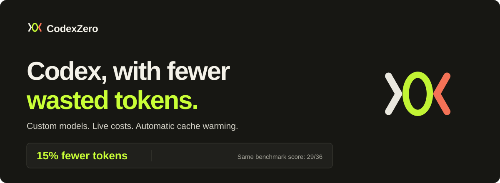
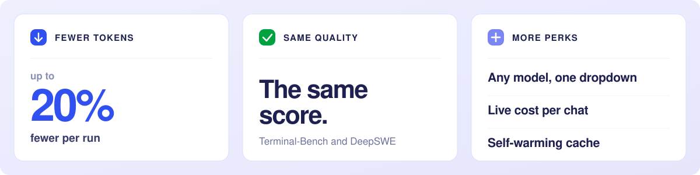
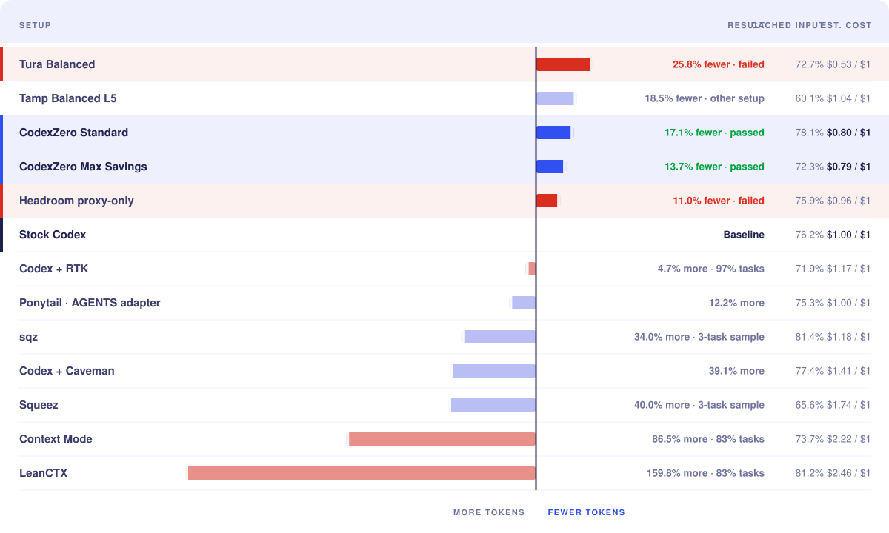
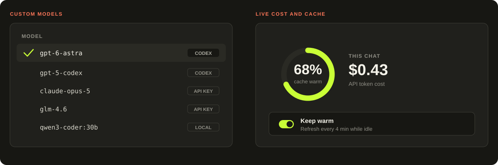
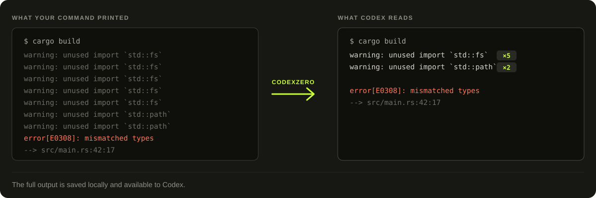

<div align="center">



[](https://github.com/Retro2512/CodexZero/actions/workflows/ci.yml)
[](https://github.com/Retro2512/CodexZero/releases/latest)
[](LICENSE)

**[Install](#install) &nbsp;·&nbsp; [The numbers](#the-numbers) &nbsp;·&nbsp; [What it adds](#what-it-adds) &nbsp;·&nbsp; [How it works](#how-it-works)**

</div>

<br>

Codex reads back everything your commands print. Build logs, test runs, file dumps. A lot of that is the same line over and over, and you pay for every copy.

**CodexZero cuts the repeats before Codex sees them.** Codex still gets the errors and anything new. It just doesn't read the same warning five times.

Same model, same answers.

<br>



<br>

## Install

### Windows

```powershell
irm https://raw.githubusercontent.com/Retro2512/CodexZero/main/scripts/bootstrap.ps1 | iex
```

That fetches the CodexZero installer, checks it, and runs it. You end up with the CodexZero app, a Desktop shortcut and a Start menu entry, and it opens itself when it's done. No admin rights, nothing to configure.

Your Codex chats, skills and settings are already in it. Nothing to import.

<sub>Rather do it by hand? [Download <b>CodexZero-Setup-windows-x64.exe</b>](https://github.com/Retro2512/CodexZero/releases/latest/download/CodexZero-Setup-windows-x64.exe) and double-click it. Uninstall from Windows Settings like any other app.</sub>

### macOS

```sh
curl -fsSL https://raw.githubusercontent.com/Retro2512/CodexZero/main/scripts/bootstrap.sh | sh
```

That fetches CodexZero, checks it, and sets up the CodexZero app in your Applications folder. It opens itself when it's done. No admin rights, nothing to configure.

Your Codex chats, skills and settings are already in it. Nothing to import.

<sub>Rather have the terminal command? Replace `| sh` with `| CODEX_ZERO_INSTALL=cli sh`. Uninstall the app by dragging it to the Trash.</sub>

<sub>[Windows script](scripts/bootstrap.ps1) · [macOS script](scripts/bootstrap.sh) · [All downloads](https://github.com/Retro2512/CodexZero/releases/latest)</sub>

<br>

## Three commands

With the terminal install, CodexZero is a command:

| | |
|---|---|
| `codex-zero run` | Codex, the lean way. This is the one you'll use. |
| `codex-zero savings` | See what you saved on your own work. |
| `codex-zero stock` | Run regular Codex. |

With the app, open **CodexZero** from your Desktop, Start menu or Applications folder instead.

<br>

## The numbers



Every tool we could get running, on the same workload, against stock Codex. Rows in red lost tasks.

> **CodexZero Standard: 17.1% fewer tokens, every task passed.**
> Nothing else cut tokens that far on Codex's own tool surface and kept the score.

<details>
<summary><b>The repeated run, and how we measured it</b></summary>

<br>

| Setup | Score | Total tokens | vs. stock Codex |
|---|---:|---:|---:|
| Codex | 29/36 | 26,580,391 | baseline |
| CodexZero | 29/36 | 22,691,418 | **14.63% fewer** |

12 tasks · 3 repetitions per setup

- [Repeated benchmark report](reports/terminal-bench-2.1-replication/README.md)
- [Full setup comparison](reports/complete-comparison-2026-07-28.md)
- [How we measured it](docs/measurement.md)

</details>

<br>

## What it adds



**Any model in the same dropdown.** Keep your Codex models and add Claude, Z.ai, or a model running on your own machine. Switch between turns.
<br><sub>Settings → Agent → Custom models · [setup and supported APIs](docs/custom-models.md)</sub>

**See what a chat costs while you're in it.** The ring shows live cost and how warm your cache is. Turn on *Keep warm* and it tops the cache up while you're idle.
<br><sub>Settings → Agent → Context cache · [cache behaviour and pricing](docs/cache-research.md)</sub>

Both live in the CodexZero app.

<br>

## How it works



1. Your command runs like normal.
2. The full output gets saved on your disk.
3. Repeated lines get collapsed into a count.
4. Codex reads the shorter version, or the original if that was already shorter.

<br>

## Settings and compatibility

<details>
<summary><b>Modes and extra commands</b></summary>

<br>

**Standard** is the default. Short instructions, Codex's normal tools.

```text
codex-zero mode standard
```

**Focused** batches independent tool calls. Good for tool-heavy work.

```text
codex-zero mode focused
```

`safe` uses regular Codex tools and instructions. `max-save` is another name for Standard.

Pick a model for one run:

```text
codex-zero run --model gpt-6-astra
```

Run a batch of configured checks:

```text
codex-zero run-checks verify --summary
```

</details>

<details>
<summary><b>What it runs on</b></summary>

<br>

- **Windows x64** — the CodexZero app, installed per user, updates itself
- **Intel Mac · Apple silicon Mac** — the CodexZero app on macOS 13 or later, updates itself, or the `codex-zero` command
- Node.js 20+ if you're building from a source checkout

Release packages include the runtime.

On macOS, quit Codex completely before running `codex-zero desktop`.

[Full compatibility notes](docs/compatibility.md)

</details>

<br>

## More

[Architecture](docs/architecture.md) &nbsp;·&nbsp; [Measurement](docs/measurement.md) &nbsp;·&nbsp; [Custom models](docs/custom-models.md) &nbsp;·&nbsp; [Cache research](docs/cache-research.md) &nbsp;·&nbsp; [Contributing](CONTRIBUTING.md) &nbsp;·&nbsp; [Security](SECURITY.md) &nbsp;·&nbsp; [Uninstall](docs/rollback.md)
