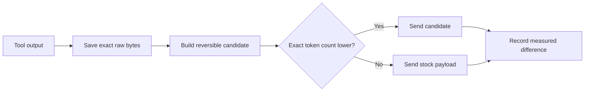

<div align="center">
  
  <h1>CodexZero</h1>
  <p><strong>Spend fewer tokens on the setup. Keep more for the work.</strong></p>

  [](https://github.com/Retro2512/CodexZero/actions/workflows/ci.yml)
  [](https://github.com/Retro2512/CodexZero/releases/latest)
  [](LICENSE)
</div>


## The short version

In full-lean mode, CodexZero cuts the dated GPT-5.6-sol model-instruction block from **3,552 tokens to 738**.

| | Before CodexZero | After CodexZero | Difference |
|---|---:|---:|---:|
| One model request | 3,552 | 738 | **2,814 fewer (−79.2%)** |
| One week at 50 requests/day | 1,243,200 | 258,300 | **984,900 fewer** |
| Same instruction-token budget | 1× request capacity | 4.8× request capacity | **+381% prompt capacity** |

Put simply: the model receives a much smaller setup before each request. If only that setup counted, the same token budget would fit 4.8 times as many requests.

Codex plans also count other input, output, caching, and service rules. **“+381% prompt capacity” is not a promise that your plan limit will increase by 381%.** It describes the model-instruction part only.

CodexZero then saves more when a tool result contains repetition it can represent with fewer tokens. If the compact result is not smaller, it sends the stock result instead. Your original output stays in a local SHA-256-addressed artifact.

### Two savings, one local total

1. **Every model request:** full-lean mode removes 2,814 instruction tokens in the dated comparison.
2. **Eligible tool results:** CodexZero sends a smaller view only after an exact token count proves it is smaller.

Run `codex-zero savings` to see your measured combined token reduction. The [site calculator](https://retro2512.github.io/CodexZero/#projection) shows the same before-and-after view for a week.

## Install

### Windows

```powershell
irm https://raw.githubusercontent.com/Retro2512/CodexZero/main/scripts/bootstrap.ps1 | iex
```

### macOS

```sh
curl -fsSL https://raw.githubusercontent.com/Retro2512/CodexZero/main/scripts/bootstrap.sh | sh
```

Release packages include the runtime. Supported release targets: Windows x64, Intel Mac, and Apple silicon Mac.

The installer asks which mode you want:

- **Full lean (default):** the 738-token lean prompt plus smaller eligible tool results.
- **Command output only:** keep the existing model prompt and optimize eligible tool results.

Change the choice later with `codex-zero mode command-output` or `codex-zero mode full-lean`.

```text
codex-zero run                    optimized side-by-side CLI
codex-zero desktop                signed Desktop app + side-by-side core
codex-zero savings               measured savings over time
codex-zero mode [MODE]            show or select the optimization mode
codex-zero run-checks <profile>  one local validation batch
codex-zero stock                 untouched stock CLI
codex-zero doctor                installation checks
```

## Where the numbers come from

### Model instructions

The prompt percentages use exact `o200k_base` counts against dated prompt snapshots:

| Dated prompt reference | Before | Full lean | Difference |
|---|---:|---:|---:|
| GPT-5.6-sol, July 24 | 3,552 | 738 | **2,814 fewer (79.2%)** |
| GPT-5.5 hotfix lineage, July 5 | 4,069 | 738 | **3,331 fewer (81.9%)** |

The weekly example is simple multiplication:

```text
50 requests/day × 7 days × 3,552 tokens = 1,243,200 before
50 requests/day × 7 days ×   738 tokens =   258,300 after
                                              984,900 fewer
```

These are static prompt comparisons, not production telemetry. CodexZero does not replace global or project `AGENTS.md` files.

[Read the prompt benchmark](reports/prompt-benchmark.md) · [Inspect its data](reports/prompt-benchmark.json)

### Tool results

| Fixture replay | Original | Selected | Difference |
|---|---:|---:|---:|
| Eleven fixed payloads | 6,699 tokens | 1,072 tokens | 5,627 fewer (84.0%) |
| Payloads that became smaller | 2 | 2 | Repeated lines and repeated stack frames |
| Payloads kept as stock | 9 | 9 | Candidate was equal or larger |

Almost all of the corpus reduction came from two intentionally repetitive fixtures. This is regression evidence for the gate and codecs, not a predicted session-saving rate. Use `codex-zero savings` to measure your own workload.

[Read the fixture report](reports/before-after.md) · [Inspect machine-readable results](reports/fixture-payload-report.json) · [Review the measurement method](docs/measurement.md)

## How it stays monotonic



1. **Raw first.** Every transformed terminal result is stored by SHA-256 with its byte count.
2. **Reversible compact views.** Presentation-only ANSI styling may be stripped. OSC links retain visible text and URL. Only identical consecutive complete lines can use exact run-length encoding.
3. **Exact tokenizer gate.** Production uses `o200k_base`; a candidate must have fewer tokens than stock text.
4. **Proven duplicate state.** Read-only duplicates require matching output and file or repository fingerprints. The original item must remain active in context.
5. **Local measurement.** Telemetry stores counters and hashes, not prompt text or tool-output content.

After three successful launches with measured savings, an interactive terminal may show a one-time link to star the repository. CodexZero never stars it automatically.

## What does not change

- Model selection or reasoning effort
- Global and project instructions, output verbosity, compaction thresholds, or subagent policy
- Tools, MCP servers, apps, skills, plugins, permissions, or review capability
- Signed Codex Desktop packages or the installed stock CLI
- Errors, warnings, exit codes, non-identical lines, or raw diagnostics

Command-output mode also leaves model instructions unchanged. Full-lean mode changes only `model_instructions_file` for CodexZero launches.

For Desktop, quit the app completely and run `codex-zero desktop`. Codex Desktop’s supported `CODEX_CLI_PATH` override starts the signed app with the side-by-side core and runtime feature overrides. CodexZero does not alter or replace the signed package.

## Estimate and measure savings

The [site calculator](https://retro2512.github.io/CodexZero/#projection) puts prompt and tool-output savings into one weekly before-and-after:

```text
model requests per day
+ tool-output tokens per day
+ your measured tool-output reduction
```

It reports the counted input tokens before, after, saved, and how much farther the same counted budget would go. It covers model instructions and tool results, not every part of plan accounting.

```text
$ codex-zero savings
CodexZero savings
Model-visible tokens eliminated: <measured locally>
Payload tokens: <original> → <selected>
Payloads transformed: <count>
Model calls eliminated: <count>
```

Observed tokens, model calls, cache counters, and rejected candidates stay separate. In full-lean mode, `codex-zero savings` also shows the dated prompt comparison.

## FAQ

### How is this different from RTK?

[RTK](https://github.com/rtk-ai/rtk) filters shell-command output with command-specific grouping, truncation, and deduplication. CodexZero works inside its Codex build, retains the original result, and rejects any compact view that is not smaller. RTK covers more commands; CodexZero uses a narrower reversible-by-default contract.

### How is this different from Headroom?

[Headroom](https://github.com/headroomlabs-ai/headroom) compresses a broader context surface through a library, proxy, or MCP server and can retrieve omitted content. CodexZero focuses on Codex tool results and exact local fallback. Headroom is broader; CodexZero has less routing and compression machinery.

### What about Caveman and Ponytail?

[Caveman](https://github.com/JuliusBrussee/caveman) asks the model to answer more briefly. [Ponytail](https://github.com/DietrichGebert/ponytail) steers implementation choices toward less code. Both can complement tool-output reduction. CodexZero works on tool-result representation instead of adding those behavior instructions.

### Does the 84.0% fixture result predict session savings?

No. It is the combined result of eleven fixed payloads, and almost all of the reduction came from two highly repetitive fixtures. Real savings depend on the output in each session.

### Do fewer input tokens mean lower cost or more requests?

They leave more room inside the input-token part of the workload. The dated prompt comparison gives **4.8× prompt capacity (+381%)** because 738 tokens fit into 3,552 about 4.8 times. Total price and plan usage do not change by that exact ratio because output, other input, caching, and service rules also count.

### What does full lean remove?

It removes redundant behavior scripting, taste rules, response formatting rules, tool rituals, fixed progress timing, repeated safety prose, and obsolete workarounds. It keeps user authority, scope and authorization boundaries, protection for existing work, injection boundaries, proportional verification, honest reporting, and concise intermediary updates.

## Build from source

The release core is pinned to upstream Codex tag `rust-v0.145.0-alpha.30`. The patch is reproducible:

```sh
git clone --branch rust-v0.145.0-alpha.30 https://github.com/openai/codex.git upstream
git -C upstream apply ../CodexZero/patches/codex-rust-v0.145.0-alpha.30.patch
cargo build --manifest-path upstream/codex-rs/Cargo.toml -p codex-cli --release
```

Source-checkout wrapper development requires Node.js 20+:

```sh
npm test
node bin/codex-zero.mjs doctor
```

## Documentation

- [Complete project reference](PROJECT_REFERENCE.md)
- [Architecture and responsibility boundaries](docs/architecture.md)
- [Measurement method](docs/measurement.md)
- [Compatibility](docs/compatibility.md)
- [Rollback and uninstall](docs/rollback.md)
- [Security model](SECURITY.md)
- [Acceptance audit](reports/acceptance-audit.md)
- [Release verification](reports/release-verification.json)
- [Contributing](CONTRIBUTING.md)

CodexZero is an independent project and is not an official OpenAI product.
