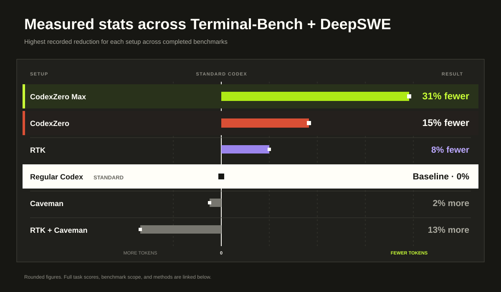
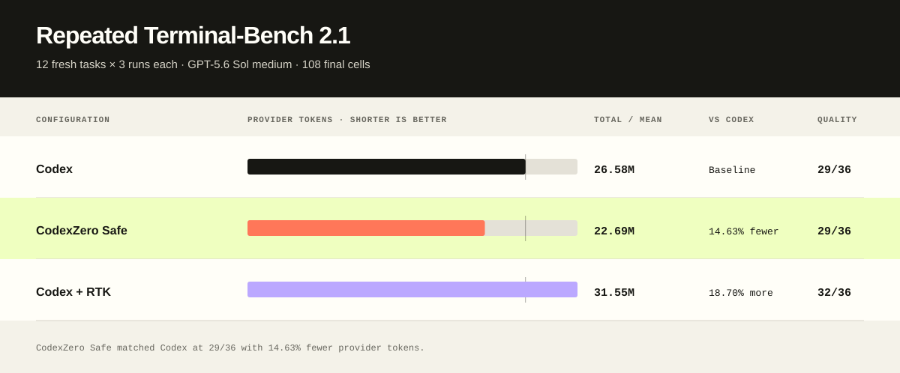
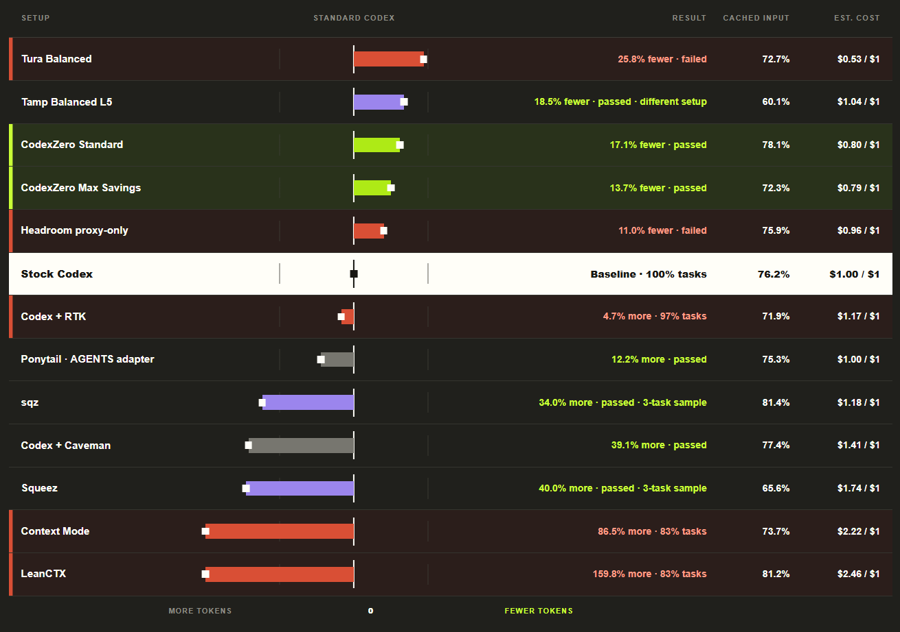
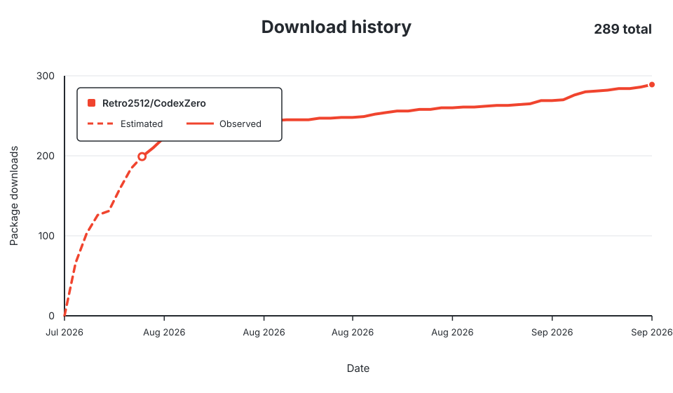

<div align="center">
  <h1>CodexZero</h1>
  <p><strong>Zero Wasted Tokens, Same Benchmark Scores &amp; Quality, More Usage Limits, Less Cost</strong></p>
</div>



[](https://github.com/Retro2512/CodexZero/actions/workflows/ci.yml)
[](https://github.com/Retro2512/CodexZero/releases/latest)
[](LICENSE)

CodexZero recorded the largest token reduction in our completed comparisons. In the strongest repeated benchmark, it:

- used **15% fewer tokens**
- matched Codex’s **29/36 task score**
- processed **3.89 million fewer tokens**
- ran the same 12 software tasks three times per setup

CodexZero installs beside Codex. Your regular CLI remains available, and the full command result stays available whenever Codex needs it.

## Install

### Windows

```powershell
irm https://raw.githubusercontent.com/Retro2512/CodexZero/main/scripts/bootstrap.ps1 | iex
```

### macOS

```sh
curl -fsSL https://raw.githubusercontent.com/Retro2512/CodexZero/main/scripts/bootstrap.sh | sh
```

Release packages include the runtime. Supported targets are Windows x64, Intel Mac, and Apple silicon Mac.

Prefer to inspect the installer first? Open the [Windows script](scripts/bootstrap.ps1), [macOS script](scripts/bootstrap.sh), or [latest release](https://github.com/Retro2512/CodexZero/releases/latest).

## Run it

```text
codex-zero run
```

Use the optimized side-by-side CLI.

```text
codex-zero savings
```

See the tokens CodexZero saved on your own work.

```text
codex-zero stock
```

Open regular Codex at any time.

## The repeated result



Codex and CodexZero each completed 12 software tasks three times. CodexZero matched the final task score while processing 22.69 million tokens instead of 26.58 million.

[Benchmark summary](reports/terminal-bench-2.1-replication/README.md)

## Complete comparison



CodexZero Standard and Max Savings both completed the comparison with fewer tokens than stock Codex. The chart marks failed runs, different setups, and smaller samples directly.

## How it works

CodexZero keeps the original command result available, removes repeated text when that produces a smaller result, and otherwise leaves the result alone.

1. Your command runs normally.
2. CodexZero saves the full result locally.
3. Repeated output can be represented more briefly.
4. If the shorter result does not save tokens, Codex receives the original.

Your model, reasoning level, tools, project instructions, permissions, and existing Codex installation remain under your control.

## Settings

**Standard** is the default. It uses the bundled lean prompt with Codex’s direct tool surface. This is the fastest and lowest-cost profile in the paired quick benchmark.

```text
codex-zero mode standard
```

**Focused** adds a scoped runtime that can batch independent tool calls. Use it for tool-heavy work; the extra runtime layer can cost more on small tasks.

```text
codex-zero mode focused
```

`safe` preserves the direct Codex tool surface and stock model instructions. `max-save` is the legacy name for Standard’s direct-tool, lean-prompt behavior. The published repeated 15% result predates these modes.

## Compatibility

- Windows x64
- Intel Mac
- Apple silicon Mac
- Codex CLI and Codex Desktop
- Node.js 20+ for source-checkout development

For Desktop, quit Codex completely before running:

```text
codex-zero desktop
```

## Trust and control

- CodexZero is free and open source under the MIT license.
- Regular Codex remains available through `codex-zero stock`.
- Full command results stay available locally.
- Errors, warnings, exit codes, and non-repeated lines are preserved.
- `codex-zero savings` reports measured local results rather than a universal estimate.

Token reductions do not translate directly into the same percentage reduction on every bill or plan. Output, caching, pricing, and workload shape the final result.

## More information

- [Architecture](docs/architecture.md)
- [Compatibility details](docs/compatibility.md)
- [Security](SECURITY.md)
- [Uninstall and rollback](docs/rollback.md)
- [Contributing](CONTRIBUTING.md)

CodexZero is an independent project and is not an official OpenAI product.

## Downloads



Launch-period points are estimated from release timing and GitHub traffic. Daily points from July 30 onward use observed package totals. Checksum files are excluded.
