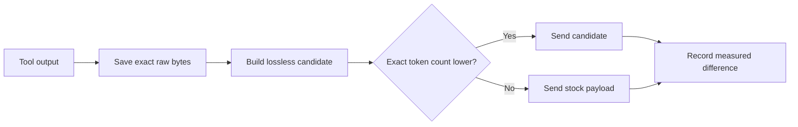

<div align="center">
  
  <h1>CodexZero</h1>
  <p><strong>Zero wasted turns.</strong></p>
  <p>Measured, lossless input savings for Codex.</p>

  [](https://github.com/Retro2512/CodexZero/actions/workflows/ci.yml)
  [](https://github.com/Retro2512/CodexZero/releases/latest)
  [](LICENSE)
</div>


CodexZero is a side-by-side Codex CLI build that removes provably redundant model input. It preserves complete raw tool output in a SHA-256 artifact store and uses exact token counts to reject any candidate that is not strictly smaller. Stock Codex remains untouched.

## Install

### Windows

```powershell
irm https://raw.githubusercontent.com/Retro2512/CodexZero/main/scripts/bootstrap.ps1 | iex
```

### macOS

```sh
curl -fsSL https://raw.githubusercontent.com/Retro2512/CodexZero/main/scripts/bootstrap.sh | sh
```

Release packages include the runtime. Supported release targets: Windows x64, Intel Mac, and Apple silicon Mac.

```text
codex-zero run                    optimized side-by-side CLI
codex-zero desktop                signed Desktop app + side-by-side core
codex-zero savings               measured savings over time
codex-zero run-checks <profile>  one local validation batch
codex-zero stock                 untouched stock CLI
codex-zero doctor                installation checks
```

## Deterministic fixture result

| Fixture replay | Before | Selected | Difference |
|---|---:|---:|---:|
| Repeated-lines fixture | 2,291 tokens | 145 tokens | **2,146 fewer (93.7%)** |
| Raw fixture output | 11,037 bytes | 11,037 bytes retained | **byte-identical** |
| Silent 60-second fixture | 2 model requests | 2 model requests | **no gain; patch rejected** |
| Exact metadata deduplication | — | — | **no duplicate blocks; rejected** |

These are deterministic test fixtures, not production telemetry or a record of anyone’s usage.

[Read the fixture report](reports/before-after.md) · [Inspect machine-readable fixture results](reports/fixture-payload-report.json)

## How it stays monotonic



1. **Raw first.** Every transformed terminal result is stored by SHA-256 with its byte count.
2. **Lossless transforms only.** Presentation-only ANSI styling may be stripped. OSC links retain visible text and URL. Only identical consecutive complete lines can use exact run-length encoding.
3. **Exact tokenizer gate.** Production uses `o200k_base`; a candidate must have fewer tokens than stock text.
4. **Proven duplicate state.** Read-only duplicates require matching output and file or repository fingerprints. The original item must remain active in context.
5. **Local measurement.** Telemetry stores counters and hashes, not prompt text or tool-output content.

## What does not change

- Model selection or reasoning effort
- Prompt files, output verbosity, compaction thresholds, or subagent policy
- Tools, MCP servers, apps, skills, plugins, permissions, or review capability
- Signed Codex Desktop packages or the installed stock CLI
- Errors, warnings, exit codes, non-identical lines, or raw diagnostics

For Desktop, quit the app completely and run `codex-zero desktop`. Codex Desktop’s supported `CODEX_CLI_PATH` override starts the signed app with the side-by-side core and runtime feature overrides. CodexZero does not alter or replace the signed package.

## Savings monitor

`codex-zero savings` reports counters stored on the current machine. It does not upload usage data.

## Build from source

The release core is pinned to upstream Codex tag `rust-v0.145.0-alpha.30`. The patch is reproducible:

```sh
git clone --branch rust-v0.145.0-alpha.30 https://github.com/openai/codex.git upstream
git -C upstream apply ../CodexZero/patches/codex-rust-v0.145.0-alpha.30.patch
cargo build --manifest-path upstream/codex-rs/Cargo.toml -p codex-cli --release
```

Source-checkout wrapper development requires Node.js 20+:

```sh
npm test
node bin/codex-zero.mjs doctor
```

## Documentation

- [Architecture and responsibility boundaries](docs/architecture.md)
- [Measurement method](docs/measurement.md)
- [Compatibility](docs/compatibility.md)
- [Rollback and uninstall](docs/rollback.md)
- [Security model](SECURITY.md)
- [Contributing](CONTRIBUTING.md)

CodexZero is an independent project and is not an official OpenAI product.
