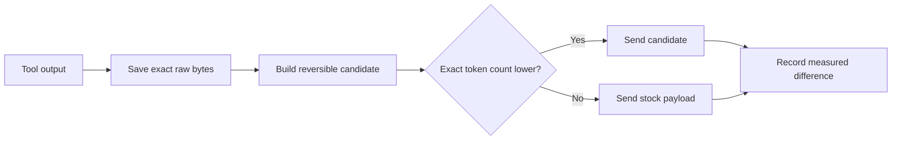

<div align="center">
  
  <h1>CodexZero</h1>
  <p><strong>Run Codex with fewer tokens.</strong></p>

  [](https://github.com/Retro2512/CodexZero/actions/workflows/ci.yml)
  [](https://github.com/Retro2512/CodexZero/releases/latest)
  [](LICENSE)
</div>


## Same task score. 14.63% fewer tokens.

CodexZero sits beside Codex and can shorten repeated tool output before the model has to read it again. In the newest repeated public benchmark, **CodexZero finished with the same 29/36 score as regular Codex while using 3.89 million fewer provider tokens**.

Think of tokens as the amount of text the model has to read. Less repeated reading means less model work while the original command result stays available.

- **12 fresh software tasks**, each run three times
- **29/36 for Codex and 29/36 for CodexZero**
- **22.69M tokens instead of 26.58M**
- **7.40% lower API-equivalent cost in this run**
- Every configuration started in its own fresh workspace and Codex home

[See the complete repeated run](reports/terminal-bench-2.1-replication/README.md) · [Inspect all 108 final trials](reports/terminal-bench-2.1-replication/trials.json) · [Open the machine-readable totals](reports/terminal-bench-2.1-replication/summary.json)

## Every completed comparison

Each chart uses Codex as its own baseline. Shorter bars mean the model processed fewer provider tokens. The quality column uses the scoring system for that test.

### Controlled repeatable workloads


All five setups passed all 18 checks. CodexZero Max used **13.72% fewer tokens** than Codex across the same fixed workloads.

[Full controlled report](reports/five-way-benchmark.md) · [All controlled metrics](reports/five-way-benchmark.json)

### Earlier six-way Terminal-Bench check


This first public panel tested more combinations once per task. The repeated three-way run above is the stronger measurement for Codex, Safe, and RTK.

[Full six-way report](reports/terminal-bench-2.1-mini/README.md) · [Machine-readable totals](reports/terminal-bench-2.1-mini/summary.json)

### DeepSWE at high reasoning


This earlier run tested the leaner Max setup. It saved **4.75%** of provider tokens and resolved 6/10 tasks, compared with Codex at 8/10. Safe was created after this run and was not part of it.

[Full DeepSWE report](reports/deepswe-sol-high-10/README.md) · [Machine-readable totals](reports/deepswe-sol-high-10/summary.json)

### Every mode combination


All 36 runs passed the fixed task. **Max + RTK used 19.14% fewer tokens** than stock Codex in this low-reasoning check.

[Full combination report](reports/combination-benchmark.md) · [Machine-readable totals](reports/combination-benchmark.json)

### One-task DeepSWE pilot


Both setups resolved the task. The historical Max setup used **31.30% fewer tokens**. This is a one-task result, so the larger runs above carry more weight.

[Full pilot report](reports/deepswe-pilot.md) · [Machine-readable totals](reports/deepswe-pilot.json)

## Two modes

| Mode | What it does | Best fit | Default |
|---|---|---|---|
| **Safe** | Keeps Codex’s normal instructions and shortens eligible command results | Everyday work | **Yes** |
| **Max Savings** | Also replaces the long built-in instruction sheet with a 738-token version | Repeatable work | No |

Safe matched stock Codex at 29/36 in the repeated public run. Max produced the lowest token total in several fixed-workload checks. Switch any time with `codex-zero mode safe` or `codex-zero mode max-save`.

## Install

### Windows

```powershell
irm https://raw.githubusercontent.com/Retro2512/CodexZero/main/scripts/bootstrap.ps1 | iex
```

### macOS

```sh
curl -fsSL https://raw.githubusercontent.com/Retro2512/CodexZero/main/scripts/bootstrap.sh | sh
```

Release packages include the runtime. Supported release targets: Windows x64, Intel Mac, and Apple silicon Mac.

The installer asks which mode you want:

- **Safe (default):** preserve Codex model instructions and compact eligible tool results.
- **Max Savings:** add the 738-token prompt for the largest input reduction.

Change the choice later with `codex-zero mode safe` or `codex-zero mode max-save`.

```text
codex-zero run                    optimized side-by-side CLI
codex-zero desktop                signed Desktop app + side-by-side core
codex-zero savings               measured savings over time
codex-zero mode [MODE]            show or select the optimization mode
codex-zero run-checks <profile>  one local validation batch
codex-zero stock                 untouched stock CLI
codex-zero doctor                installation checks
```

## Where the numbers come from

### Repeated Terminal-Bench replication

The main comparison uses a sealed, deterministic 12-task sample from the 77 Terminal-Bench 2.1 tasks not used in the first panel. Codex, CodexZero Safe, and Codex + RTK each ran three times per task through Harbor with isolated homes, mounted binaries, official verifiers, a 900-second agent cap, and no quality retries.

The report retains the official 36-outcome score, per-task stability, verifier subtests, Wilson and task-cluster intervals, paired tests, input, cached input, uncached input, output, reasoning output, requests, cache-hit requests, assistant messages, tool calls, shell commands, time, API-equivalent cost, Codex credits, optimizer telemetry, and artifact hashes.

[Read the repeated Terminal-Bench report](reports/terminal-bench-2.1-replication/README.md) · [Inspect the sealed design](reports/terminal-bench-2.1-replication/preregistration.json) · [Inspect normalized trials](reports/terminal-bench-2.1-replication/trials.json)

### Earlier six-way mini-panel

The earlier panel ran six configurations once per task and retained strict and scorable scores across 72 final cells. Its wider configuration coverage remains useful, but the repeated run above is the primary quality and efficiency comparison.

[Read the earlier six-way report](reports/terminal-bench-2.1-mini/README.md)

### Controlled end-to-end benchmark

The five-way result uses six fixed workloads, three repetitions, randomized interleaving, a fresh thread and disposable workspace for every trial, and isolated Codex homes and telemetry. It compares stock and patched cores from the same `0.145.0-alpha.30` release. Provider counters are authoritative; cache reads, uncached input, output, reasoning, requests, tool payloads, visible answers, wall time, and optimizer-native counters are all retained.

The evidence audit rehashed 90 raw execution streams and 192 provider-visible tool payloads before writing the report. The corpus is reproducible evidence for these workloads, not a universal savings percentage.

[Read the benchmark controls and workload results](reports/five-way-benchmark.md)

### Model instructions

The prompt percentages use exact `o200k_base` counts against dated prompt snapshots:

| Dated prompt reference | Before | Max Savings | Difference |
|---|---:|---:|---:|
| GPT-5.6-sol, July 24 | 3,552 | 738 | **2,814 fewer (79.2%)** |
| GPT-5.5 hotfix lineage, July 5 | 4,069 | 738 | **3,331 fewer (81.9%)** |

The weekly example is simple multiplication:

```text
50 requests/day × 7 days × 3,552 tokens = 1,243,200 before
50 requests/day × 7 days ×   738 tokens =   258,300 after
                                              984,900 fewer
```

These are static prompt comparisons, not production telemetry. CodexZero does not replace global or project `AGENTS.md` files.

[Read the prompt benchmark](reports/prompt-benchmark.md) · [Inspect its data](reports/prompt-benchmark.json)

### Tool results

| Fixture replay | Original | Selected | Difference |
|---|---:|---:|---:|
| Eleven fixed payloads | 6,699 tokens | 1,072 tokens | 5,627 fewer (84.0%) |
| Payloads that became smaller | 2 | 2 | Repeated lines and repeated stack frames |
| Payloads kept as stock | 9 | 9 | Candidate was equal or larger |

Almost all of the corpus reduction came from two intentionally repetitive fixtures. This is regression evidence for the gate and codecs, not a predicted session-saving rate. Use `codex-zero savings` to measure your own workload.

[Read the fixture report](reports/before-after.md) · [Inspect machine-readable results](reports/fixture-payload-report.json) · [Review the measurement method](docs/measurement.md)

## How it stays monotonic



1. **Raw first.** Every transformed terminal result is stored by SHA-256 with its byte count.
2. **Reversible compact views.** Presentation-only ANSI styling may be stripped. OSC links retain visible text and URL. Only identical consecutive complete lines can use exact run-length encoding.
3. **Exact tokenizer gate.** Production uses `o200k_base`; a candidate must have fewer tokens than stock text.
4. **Proven duplicate state.** Read-only duplicates require matching output and file or repository fingerprints. The original item must remain active in context.
5. **Local measurement.** Telemetry stores counters and hashes, not prompt text or tool-output content.

After three successful launches with measured savings, an interactive terminal may show a one-time link to star the repository. CodexZero never stars it automatically.

## What does not change

- Model selection or reasoning effort
- Global and project instructions, output verbosity, compaction thresholds, or subagent policy
- Tools, MCP servers, apps, skills, plugins, permissions, or review capability
- Signed Codex Desktop packages or the installed stock CLI
- Errors, warnings, exit codes, non-identical lines, or raw diagnostics

Safe mode leaves model instructions unchanged. Max Savings mode changes only `model_instructions_file` for CodexZero launches.

For Desktop, quit the app completely and run `codex-zero desktop`. Codex Desktop’s supported `CODEX_CLI_PATH` override starts the signed app with the side-by-side core and runtime feature overrides. CodexZero does not alter or replace the signed package.

## Estimate and measure savings

The [site calculator](https://retro2512.github.io/CodexZero/#projection) lets you compare Safe and Max Savings. Safe counts tool-output savings only; Max Savings adds the dated prompt comparison.

```text
model requests per day
+ tool-output tokens per day
+ your measured tool-output reduction
```

It reports the counted input tokens before, after, saved, and how much farther the same counted budget would go. It covers model instructions and tool results, not every part of plan accounting.

```text
$ codex-zero savings
CodexZero savings
Model-visible tokens eliminated: <measured locally>
Payload tokens: <original> → <selected>
Payloads transformed: <count>
Model calls eliminated: <count>
```

Observed tokens, model calls, cache counters, and rejected candidates stay separate. In Max Savings mode, `codex-zero savings` also shows the dated prompt comparison.

## FAQ

### How is this different from RTK?

[RTK](https://github.com/rtk-ai/rtk) filters shell-command output with command-specific grouping, truncation, and deduplication. CodexZero works inside its Codex build, retains the original result, and rejects any compact view that is not smaller. In the repeated run, RTK scored 32/36 but used 18.70% more provider tokens than Codex; its three-pass quality lead was not statistically conclusive (exact p = 0.25).

### How is this different from Headroom?

[Headroom](https://github.com/headroomlabs-ai/headroom) compresses a broader context surface through a library, proxy, or MCP server and can retrieve omitted content. CodexZero focuses on Codex tool results and exact local fallback. Headroom is broader; CodexZero has less routing and compression machinery.

### What about Caveman and Ponytail?

[Caveman](https://github.com/JuliusBrussee/caveman) asks the model to answer more briefly. [Ponytail](https://github.com/DietrichGebert/ponytail) steers implementation choices toward less code. Both can complement tool-output reduction. CodexZero works on tool-result representation instead of adding those behavior instructions.

### Does the 84.0% fixture result predict session savings?

No. It is the combined result of eleven fixed payloads, and almost all of the reduction came from two highly repetitive fixtures. Real savings depend on the output in each session.

### Do fewer input tokens mean lower cost or more requests?

They leave more room inside the input-token part of the workload. The dated prompt comparison gives **4.8× prompt capacity (+381%)** because 738 tokens fit into 3,552 about 4.8 times. Total price and plan usage do not change by that exact ratio because output, other input, caching, and service rules also count.

### What does Max Savings remove?

It removes redundant behavior scripting, taste rules, response formatting rules, tool rituals, fixed progress timing, repeated safety prose, and obsolete workarounds. It keeps user authority, scope and authorization boundaries, protection for existing work, injection boundaries, proportional verification, honest reporting, and concise intermediary updates.

## Build from source

The release core is pinned to upstream Codex tag `rust-v0.145.0-alpha.30`. The patch is reproducible:

```sh
git clone --branch rust-v0.145.0-alpha.30 https://github.com/openai/codex.git upstream
git -C upstream apply ../CodexZero/patches/codex-rust-v0.145.0-alpha.30.patch
cargo build --manifest-path upstream/codex-rs/Cargo.toml -p codex-cli --release
```

Source-checkout wrapper development requires Node.js 20+:

```sh
npm test
node bin/codex-zero.mjs doctor
```

## Documentation

- [Complete project reference](PROJECT_REFERENCE.md)
- [Architecture and responsibility boundaries](docs/architecture.md)
- [Measurement method](docs/measurement.md)
- [Compatibility](docs/compatibility.md)
- [Rollback and uninstall](docs/rollback.md)
- [Security model](SECURITY.md)
- [Acceptance audit](reports/acceptance-audit.md)
- [Isolated combination benchmark](reports/combination-benchmark.md)
- [Five-way end-to-end benchmark](reports/five-way-benchmark.md)
- [DeepSWE 10-task, five-way public-verifier benchmark](reports/deepswe-sol-high-10/README.md)
- [Release verification](reports/release-verification.json)
- [Contributing](CONTRIBUTING.md)

CodexZero is an independent project and is not an official OpenAI product.
