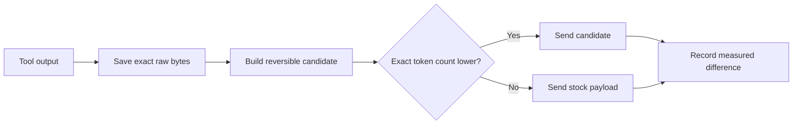

<div align="center">
  
  <h1>CodexZero</h1>
  <p><strong>Safe by default. Max Savings is opt-in and publishes its quality tradeoff.</strong></p>

  [](https://github.com/Retro2512/CodexZero/actions/workflows/ci.yml)
  [](https://github.com/Retro2512/CodexZero/releases/latest)
  [](LICENSE)
</div>


## Public benchmark first

Twelve fresh [Terminal-Bench 2.1](https://www.tbench.ai/news/terminal-bench-2-1) tasks ran three times through official [Harbor](https://www.harborframework.com/docs/run-jobs/run-evals) verifiers for each configuration. All **108 final cells** used `gpt-5.6-sol` at medium reasoning in isolated containers.

| Configuration | Official score | Wilson 95% | Majority tasks | Verifier assertions | Provider tokens | Difference vs Codex | API-equivalent cost | Agent time |
|---|---:|---:|---:|---:|---:|---:|---:|---:|
| Codex | **29/36 (80.56%)** | 64.97%–90.25% | 10/12 | 92/105 | 26,580,391 | Baseline | $25.1385 | 168.3 min |
| **CodexZero Safe** | **29/36 (80.56%)** | **64.97%–90.25%** | **10/12** | **91/105** | **22,691,418** | **14.63% less** | **$23.2770 · 7.40% less** | **172.4 min** |
| Codex + RTK | **32/36 (88.89%)** | 74.69%–95.59% | 11/12 | 95/105 | 31,550,572 | 18.70% more | $28.9572 · 15.19% more | 180.8 min |

**CodexZero Safe exactly matched Codex: 29/36 (80.56%) each.** It used **14.63% fewer provider tokens** and **7.40% less API-equivalent cost** in this run. The 36-outcome score resolves to **2.78 percentage points**, replacing the earlier panel’s coarse 10-point steps.

RTK’s quality point estimate was 8.33 points higher, but the paired exact result was **p = 0.25** and the task-cluster interval includes zero. RTK used 18.70% more tokens in this replication, reversing its efficiency result from the earlier one-attempt panel.

The task sample and analysis were sealed before model calls. Two validation waves exposed container certificate and runtime defects; the correction was sealed before replacement calls, and the entire 108-cell matrix was rerun rather than selectively keeping successes. All 72 discarded attempts remain available for audit.

[Full repeated-run report](reports/terminal-bench-2.1-replication/README.md) · [Aggregate statistics](reports/terminal-bench-2.1-replication/summary.json) · [All 108 final trials](reports/terminal-bench-2.1-replication/trials.json) · [All 180 attempts](reports/terminal-bench-2.1-replication/attempts.json) · [Sealed preregistration](reports/terminal-bench-2.1-replication/preregistration.json) · [Sealed infrastructure correction](reports/terminal-bench-2.1-replication/infrastructure-addendum.json)

### Earlier six-way breadth check

The first sealed panel compared Codex, Safe, Max Savings, RTK, Caveman, and Caveman + RTK once across 12 tasks. Safe, Codex, and RTK each scored 7/10 scorable tasks. It was useful for breadth, but its 10-point score steps and single attempts were not precise enough to rank close configurations.

[Earlier six-way report](reports/terminal-bench-2.1-mini/README.md) · [Earlier aggregate statistics](reports/terminal-bench-2.1-mini/summary.json)

Historical context: an earlier 10-task [DeepSWE run](reports/deepswe-sol-high-10/README.md) tested what is now Max Savings at high reasoning. It used 4.75% fewer tokens but resolved 6/10 tasks versus stock Codex at 8/10. It did not test Safe mode.

### Controlled repeatable-workload check

Across **90 isolated `gpt-5.6-sol` medium trials** on six fixed workloads, every configuration passed all 18 quality gates:

| Configuration | Quality | Mean provider tokens | Difference vs Codex | Cache token hit | Mean time |
|---|---:|---:|---:|---:|---:|
| Codex | 18/18 | 46,263 | Baseline | 72.1% | 18.1s |
| **CodexZero Max Savings** | **18/18** | **39,915** | **13.72% fewer** | **76.8%** | 22.4s |
| Codex + RTK | 18/18 | 49,763 | 7.56% more | 76.3% | 19.8s |
| Codex + Caveman | 18/18 | 67,482 | 45.87% more | 77.5% | 25.8s |
| Codex + Caveman + RTK | 18/18 | 70,707 | 52.84% more | 79.6% | 29.9s |

CodexZero was lower-token in **16 of 18** paired trials. The exact two-sided sign-test result was **p = 0.001312**; the workload-stratified 95% confidence interval was **5,423 to 7,828 fewer tokens per trial**. Its mean wall time was 4.3 seconds longer than stock Codex.

[Full controlled report](reports/five-way-benchmark.md) · [All controlled-trial metrics](reports/five-way-benchmark.json) · [Historical Max Savings harness](tools/benchmark-five-way-max-savings-v1.py) · [Safe/Max Savings harness](tools/benchmark-five-way.py)

## Two modes

| Mode | Model instructions | Tool-result pipeline | Default |
|---|---|---|---|
| **Safe** | Stock Codex instructions | Guarded compact payloads with raw artifacts and stock fallback | **Yes** |
| **Max Savings** | Bundled 738-token prompt | Same guarded pipeline | No |

Safe targets quality parity by leaving Codex’s model instructions alone. It matched stock Codex at 29/36 in the repeated Terminal-Bench run. Max Savings was not included in that replication; it matched Codex at 7/10 in the earlier six-way panel but used 21.05% more tokens there. Existing `command-output` installs map to Safe; existing `full-lean` installs map to Max Savings.

## Install

### Windows

```powershell
irm https://raw.githubusercontent.com/Retro2512/CodexZero/main/scripts/bootstrap.ps1 | iex
```

### macOS

```sh
curl -fsSL https://raw.githubusercontent.com/Retro2512/CodexZero/main/scripts/bootstrap.sh | sh
```

Release packages include the runtime. Supported release targets: Windows x64, Intel Mac, and Apple silicon Mac.

The installer asks which mode you want:

- **Safe (default):** preserve Codex model instructions and compact eligible tool results.
- **Max Savings:** add the 738-token prompt for the largest input reduction.

Change the choice later with `codex-zero mode safe` or `codex-zero mode max-save`.

```text
codex-zero run                    optimized side-by-side CLI
codex-zero desktop                signed Desktop app + side-by-side core
codex-zero savings               measured savings over time
codex-zero mode [MODE]            show or select the optimization mode
codex-zero run-checks <profile>  one local validation batch
codex-zero stock                 untouched stock CLI
codex-zero doctor                installation checks
```

## Where the numbers come from

### Repeated Terminal-Bench replication

The main comparison uses a sealed, deterministic 12-task sample from the 77 Terminal-Bench 2.1 tasks not used in the first panel. Codex, CodexZero Safe, and Codex + RTK each ran three times per task through Harbor with isolated homes, mounted binaries, official verifiers, a 900-second agent cap, and no quality retries.

The report retains the official 36-outcome score, per-task stability, verifier subtests, Wilson and task-cluster intervals, paired tests, input, cached input, uncached input, output, reasoning output, requests, cache-hit requests, assistant messages, tool calls, shell commands, time, API-equivalent cost, Codex credits, optimizer telemetry, and artifact hashes.

[Read the repeated Terminal-Bench report](reports/terminal-bench-2.1-replication/README.md) · [Inspect the sealed design](reports/terminal-bench-2.1-replication/preregistration.json) · [Inspect normalized trials](reports/terminal-bench-2.1-replication/trials.json)

### Earlier six-way mini-panel

The earlier panel ran six configurations once per task and retained strict and scorable scores across 72 final cells. Its wider configuration coverage remains useful, but the repeated run above is the primary quality and efficiency comparison.

[Read the earlier six-way report](reports/terminal-bench-2.1-mini/README.md)

### Controlled end-to-end benchmark

The five-way result uses six fixed workloads, three repetitions, randomized interleaving, a fresh thread and disposable workspace for every trial, and isolated Codex homes and telemetry. It compares stock and patched cores from the same `0.145.0-alpha.30` release. Provider counters are authoritative; cache reads, uncached input, output, reasoning, requests, tool payloads, visible answers, wall time, and optimizer-native counters are all retained.

The evidence audit rehashed 90 raw execution streams and 192 provider-visible tool payloads before writing the report. The corpus is reproducible evidence for these workloads, not a universal savings percentage.

[Read the benchmark controls and workload results](reports/five-way-benchmark.md)

### Model instructions

The prompt percentages use exact `o200k_base` counts against dated prompt snapshots:

| Dated prompt reference | Before | Max Savings | Difference |
|---|---:|---:|---:|
| GPT-5.6-sol, July 24 | 3,552 | 738 | **2,814 fewer (79.2%)** |
| GPT-5.5 hotfix lineage, July 5 | 4,069 | 738 | **3,331 fewer (81.9%)** |

The weekly example is simple multiplication:

```text
50 requests/day × 7 days × 3,552 tokens = 1,243,200 before
50 requests/day × 7 days ×   738 tokens =   258,300 after
                                              984,900 fewer
```

These are static prompt comparisons, not production telemetry. CodexZero does not replace global or project `AGENTS.md` files.

[Read the prompt benchmark](reports/prompt-benchmark.md) · [Inspect its data](reports/prompt-benchmark.json)

### Tool results

| Fixture replay | Original | Selected | Difference |
|---|---:|---:|---:|
| Eleven fixed payloads | 6,699 tokens | 1,072 tokens | 5,627 fewer (84.0%) |
| Payloads that became smaller | 2 | 2 | Repeated lines and repeated stack frames |
| Payloads kept as stock | 9 | 9 | Candidate was equal or larger |

Almost all of the corpus reduction came from two intentionally repetitive fixtures. This is regression evidence for the gate and codecs, not a predicted session-saving rate. Use `codex-zero savings` to measure your own workload.

[Read the fixture report](reports/before-after.md) · [Inspect machine-readable results](reports/fixture-payload-report.json) · [Review the measurement method](docs/measurement.md)

## How it stays monotonic



1. **Raw first.** Every transformed terminal result is stored by SHA-256 with its byte count.
2. **Reversible compact views.** Presentation-only ANSI styling may be stripped. OSC links retain visible text and URL. Only identical consecutive complete lines can use exact run-length encoding.
3. **Exact tokenizer gate.** Production uses `o200k_base`; a candidate must have fewer tokens than stock text.
4. **Proven duplicate state.** Read-only duplicates require matching output and file or repository fingerprints. The original item must remain active in context.
5. **Local measurement.** Telemetry stores counters and hashes, not prompt text or tool-output content.

After three successful launches with measured savings, an interactive terminal may show a one-time link to star the repository. CodexZero never stars it automatically.

## What does not change

- Model selection or reasoning effort
- Global and project instructions, output verbosity, compaction thresholds, or subagent policy
- Tools, MCP servers, apps, skills, plugins, permissions, or review capability
- Signed Codex Desktop packages or the installed stock CLI
- Errors, warnings, exit codes, non-identical lines, or raw diagnostics

Safe mode leaves model instructions unchanged. Max Savings mode changes only `model_instructions_file` for CodexZero launches.

For Desktop, quit the app completely and run `codex-zero desktop`. Codex Desktop’s supported `CODEX_CLI_PATH` override starts the signed app with the side-by-side core and runtime feature overrides. CodexZero does not alter or replace the signed package.

## Estimate and measure savings

The [site calculator](https://retro2512.github.io/CodexZero/#projection) lets you compare Safe and Max Savings. Safe counts tool-output savings only; Max Savings adds the dated prompt comparison.

```text
model requests per day
+ tool-output tokens per day
+ your measured tool-output reduction
```

It reports the counted input tokens before, after, saved, and how much farther the same counted budget would go. It covers model instructions and tool results, not every part of plan accounting.

```text
$ codex-zero savings
CodexZero savings
Model-visible tokens eliminated: <measured locally>
Payload tokens: <original> → <selected>
Payloads transformed: <count>
Model calls eliminated: <count>
```

Observed tokens, model calls, cache counters, and rejected candidates stay separate. In Max Savings mode, `codex-zero savings` also shows the dated prompt comparison.

## FAQ

### How is this different from RTK?

[RTK](https://github.com/rtk-ai/rtk) filters shell-command output with command-specific grouping, truncation, and deduplication. CodexZero works inside its Codex build, retains the original result, and rejects any compact view that is not smaller. In the repeated run, RTK scored 32/36 but used 18.70% more provider tokens than Codex; its three-pass quality lead was not statistically conclusive (exact p = 0.25).

### How is this different from Headroom?

[Headroom](https://github.com/headroomlabs-ai/headroom) compresses a broader context surface through a library, proxy, or MCP server and can retrieve omitted content. CodexZero focuses on Codex tool results and exact local fallback. Headroom is broader; CodexZero has less routing and compression machinery.

### What about Caveman and Ponytail?

[Caveman](https://github.com/JuliusBrussee/caveman) asks the model to answer more briefly. [Ponytail](https://github.com/DietrichGebert/ponytail) steers implementation choices toward less code. Both can complement tool-output reduction. CodexZero works on tool-result representation instead of adding those behavior instructions.

### Does the 84.0% fixture result predict session savings?

No. It is the combined result of eleven fixed payloads, and almost all of the reduction came from two highly repetitive fixtures. Real savings depend on the output in each session.

### Do fewer input tokens mean lower cost or more requests?

They leave more room inside the input-token part of the workload. The dated prompt comparison gives **4.8× prompt capacity (+381%)** because 738 tokens fit into 3,552 about 4.8 times. Total price and plan usage do not change by that exact ratio because output, other input, caching, and service rules also count.

### What does Max Savings remove?

It removes redundant behavior scripting, taste rules, response formatting rules, tool rituals, fixed progress timing, repeated safety prose, and obsolete workarounds. It keeps user authority, scope and authorization boundaries, protection for existing work, injection boundaries, proportional verification, honest reporting, and concise intermediary updates.

## Build from source

The release core is pinned to upstream Codex tag `rust-v0.145.0-alpha.30`. The patch is reproducible:

```sh
git clone --branch rust-v0.145.0-alpha.30 https://github.com/openai/codex.git upstream
git -C upstream apply ../CodexZero/patches/codex-rust-v0.145.0-alpha.30.patch
cargo build --manifest-path upstream/codex-rs/Cargo.toml -p codex-cli --release
```

Source-checkout wrapper development requires Node.js 20+:

```sh
npm test
node bin/codex-zero.mjs doctor
```

## Documentation

- [Complete project reference](PROJECT_REFERENCE.md)
- [Architecture and responsibility boundaries](docs/architecture.md)
- [Measurement method](docs/measurement.md)
- [Compatibility](docs/compatibility.md)
- [Rollback and uninstall](docs/rollback.md)
- [Security model](SECURITY.md)
- [Acceptance audit](reports/acceptance-audit.md)
- [Isolated combination benchmark](reports/combination-benchmark.md)
- [Five-way end-to-end benchmark](reports/five-way-benchmark.md)
- [DeepSWE 10-task, five-way public-verifier benchmark](reports/deepswe-sol-high-10/README.md)
- [Release verification](reports/release-verification.json)
- [Contributing](CONTRIBUTING.md)

CodexZero is an independent project and is not an official OpenAI product.
